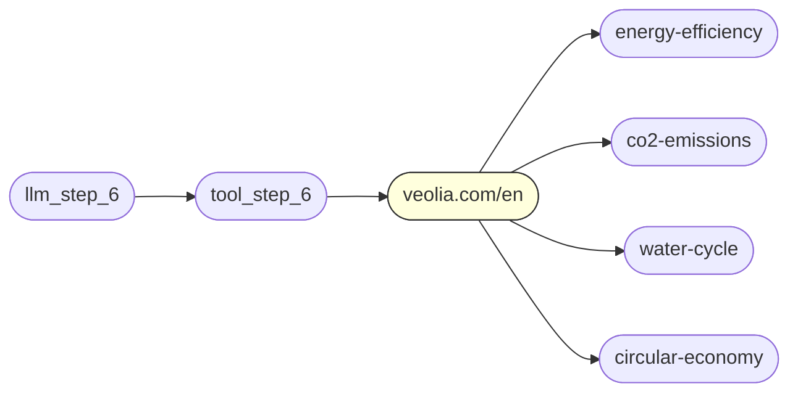
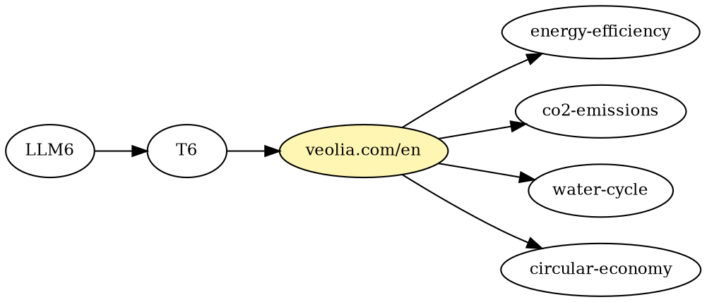
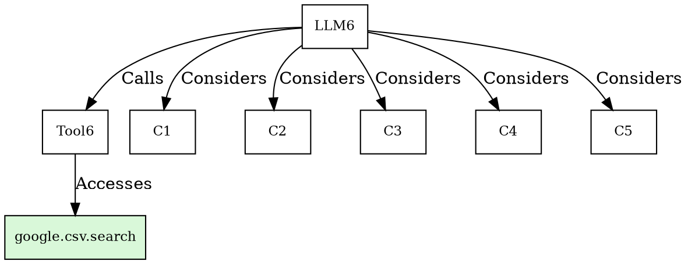
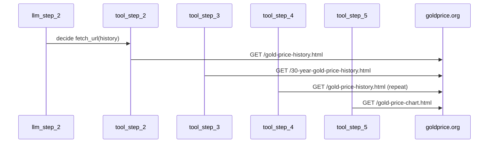
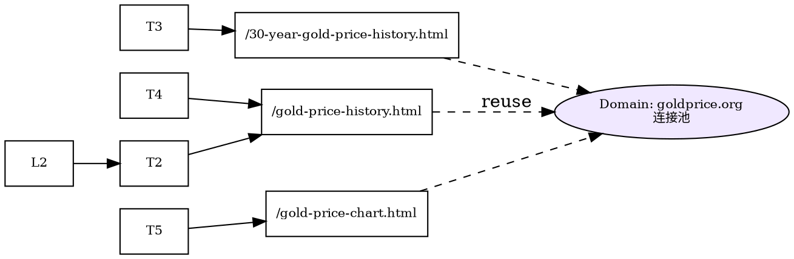

# GMAO研究报告示例补充：三类子图模式的具体分析与演示

本文档为 `research_report.md` 的配套“实践+例子”补充材料。目标：把报告中每个问题与解决方案落到具体的图数据、算法步骤、以及可验证的运行时策略示例。

---

## 目录

1. 动态执行图 (DEG) 的具体构造示例
2. 模式一：支配域星形簇 (Dominator Domain Star) 示例
3. 模式二：候选扇出 / 决策收敛 (Candidate Fan-out) 示例
4. 模式三：线性工具链与 I/O 融合 (Linear Toolchain & I/O Fusion) 示例
5. 在线调度与无损缓存策略的端到端示例
6. 小型评估：潜在毫秒级收益的估算方法
7. 后续可扩展方向建议
8. 图示可视化：三个模式与端到端时间线

---

## 1. 动态执行图 (DEG) 的具体构造示例

选取日志 `10-22-18-1` 与 `10-22-19-3` 两个图：

- `10-22-18-1_stats_v2.json` 中：LLM 决策 13 步，工具调用 13 次，候选资源总量（未全部入图的原始枚举）达到 162，已被选择的目标资源 11。域分布中 `google.com` 与 `goldprice.org` 均出现 7 次。
- `10-22-19-3_stats_v2.json` 中：LLM 决策 7 步，候选资源 97（94 未选），`veolia.com` 域相关节点数量达到 17（典型星形簇）。

我们在运行时构造 DEG 的关键事件序列（抽象）：

```
LLM(step_k_output={tool="fetch_url", candidates=[c1,...,cm]})  -->  插件拦截器: extract(tool, candidates)
工具执行器(tool_call(url_selected))                     -->  拦截 Accesses 边 + domain 推断
工具返回(result_payload)                                -->  拦截 Returns 边, 触发下轮 LLM
```

节点类型映射：

- LLM 决策节点：`llm_step_i`
- 工具调用节点：`tool_step_j`
- 已访问资源：`Target_Resource`
- 候选但未选：`Candidate_Resource`
- 归类/语义关系：用 `Groups_With` 边连接（域、功能或页面模板等共享潜在网络前置成本）。

在 `10-22-18-1_graph_topology.json` 中一个局部（精简）展示扇出：

```
llm_step_6 --Calls--> tool_step_6 --Accesses--> https://www.google.com/search?q=historical+gold+price+data+CSV
llm_step_6 --Considers--> candidate_https://goldprice.org/gold-price.html
llm_step_6 --Considers--> candidate_https://goldprice.org/gold-prices/Gold-Bars.htm
llm_step_6 --Considers--> candidate_https://translate.google.com/
...
```

此处的“候选前沿” = LLM 思考阶段暴露的 `Considers` 目标集合，调度器可在线评估其潜在价值与成本。

---

## 2. 模式一：支配域星形簇 (Dominator Domain Star) 示例

### 2.1 识别示例

在 `10-22-19-3` 中 `veolia.com` 相关已选与候选节点总计 17 个：

```
Target: https://www.veolia.com/en
Candidates (部分):
  https://www.veolia.com/en/climate-change/energy-efficiency
  https://www.veolia.com/en/climate-change/co2-emissions
  https://www.veolia.com/en/resources/water-cycle
  https://www.veolia.com/en/resources/circular-economy
  ... (共 16+ 节点)
```

图片语言：这些节点围绕同一域形成一个星形“叶簇”。任何页面内容请求都受制于首先建立到 `veolia.com` 的传输层 / 加密握手。

### 2.2 支配者分析动机

候选前沿中跨多个域：`veolia.com`, `google.com`, `globalwaterintel.com`。我们希望在**握手成本最高且重用价值最大**的域上优先进行 L0 预连接。

将当前子图抽象为流图 G：

- 源集合 S：最近一次 LLM 步骤节点（例如 `llm_step_6` 或 `llm_step_7`）。
- 目标集合 F：其 `Considers` 出边的候选资源节点集合。

我们构造一个辅助超级源 s\* 指向所有 `llm_step_k` 新产生的候选，运行简化的支配者计算（这里可用 Lengauer–Tarjan 支配者算法缩减）。

### 2.3 示例支配者计算（伪代码）

```python
# 输入: G (当前增量子图), s_star (超级源), frontier (候选资源集合)
# 输出: dominators_subset (用于预热的域集合)

def compute_domain_dominators(G, s_star, frontier):
    # Step 1: 提取所有候选节点的入路径前缀，映射到域
    domain_paths = {}  # domain -> set(path_nodes)
    for c in frontier:
        path = backtrack_llm_chain(G, c)        # 回溯到最近的 llm_step_k
        domain = extract_domain(c)
        domain_paths.setdefault(domain, set()).update(path)

    # Step 2: 构造域级控制流图 D：节点 = 域，边 = 共享上游路径依赖
    D = build_domain_flow_graph(domain_paths)

    # Step 3: 在 D 上从虚拟源 d* 运行简化支配者分析
    dominator_map = lengauer_tarjan(D, source='d*')

    # Step 4: 选取最小支配集合覆盖 frontier 的域（近似 set cover）
    dominators_subset = greedy_cover(frontier_domains(domain_paths), dominator_map)
    return dominators_subset
```

### 2.4 多层次预热计划示例

假设估算：

- `veolia.com` 平均 TLS+QUIC 握手延迟 180ms；
- `globalwaterintel.com` 160ms；
- `google.com` 已有复用连接（成本 ~30ms）。

调度器策略：

```
L0 (必做): DNS 解析 + QUIC/TLS 0-RTT 预连接: veolia.com, globalwaterintel.com
L1 (资源充裕): 预取最“慢”且高价值的 2 个 veolia 页面
      e.g. /climate-change/energy-efficiency, /resources/water-cycle
L2 (可选): HEAD 请求收集精确 Content-Length 与缓存控制，再决定是否 GET 全内容
```

无损性：真实工具调用到来时，如请求 `/resources/water-cycle`，若缓存命中直接返回正文，未命中则正常发起，不改变 LLM 输入语义。

### 2.5 预热收益估算

```
单域握手节省 ≈ 180ms (TLS+TCP/QUIC) - 0ms (已建立) = 180ms
若后续 5 个页面真实访问均命中该连接，则累积节省 ≈ 5 * 180ms = 900ms（上限）
实际命中率假设 40% => 有效收益 ≈ 360ms
```

---

## 3. 模式二：候选扇出 / 决策收敛 (Candidate Fan-out) 示例

### 3.1 示例定位

`10-22-18-1` 中 `llm_step_6` 暴露 12 个候选；下一步真实 `tool_step_6` 访问 Google 搜索页面：

```
llm_step_6 --Considers--> {goldprice.org 多页面, translate.google.com, google 搜索变体, jmbullion 广告资源...}
llm_step_6 --Calls--> tool_step_6 --Accesses--> https://www.google.com/search?q=historical+gold+price+data+CSV
```

LLM 思考时间窗口（假设）= 900ms。我们想要把最“慢”或最“可能”被选中的几个候选预取，使其在窗口结束前完成。

### 3.2 HEFT 思想映射

- 任务集合：每个候选资源的“预取任务”。
- 任务成本：估计的 完整 RTT + TTFB（Time to First Byte）。
- 约束：总并发连接数 C_max（例如 6），避免过度占用带宽。
- 目标：最大化在 LLM 输出时间之前完成的任务数（或命中概率加权完成数）。

### 3.3 延迟估计表（示例）

| URL/域                                | 历史均值RTT(ms) | 预计TTFB(ms) | 估计成本 Cost=RTT+TTFB | 初始优先级 (Upward Rank) |
| ------------------------------------- | --------------- | ------------ | ---------------------- | ------------------------ |
| goldprice.org/gold-price-history.html | 140             | 220          | 360                    | 360                      |
| goldprice.org/gold-price-chart.html   | 140             | 230          | 370                    | 370                      |
| translate.google.com                  | 30              | 90           | 120                    | 120                      |
| www.jmbullion.com/...                 | 160             | 260          | 420                    | 420                      |
| www.gstatic.com/... (logo)            | 30              | 40           | 70                     | 70                       |
| goldprice.org/gold-silver-ratio.html  | 140             | 210          | 350                    | 350                      |

### 3.4 调度伪代码

```python
# 输入: tasks (候选URL集合), llm_deadline (LLM预计完成时间戳), C_max (并发上限)
# 输出: 预取执行序列与开始时间

def schedule_speculative_prefetch(tasks, llm_deadline, C_max):
    # 1. 计算 cost & upward_rank （此处直接 cost）
    for t in tasks:
        t.cost = estimate_network_cost(t.url)
    # 2. 按 cost 降序排序 (慢的先发起)
    ordered = sorted(tasks, key=lambda x: x.cost, reverse=True)
    active = []
    now = current_time_ms()
    plan = []
    for task in ordered:
        # 3. 仅在预估完成时间 < llm_deadline 时提交
        finish_est = now + task.cost
        if finish_est < llm_deadline:
            if len(active) < C_max:
                submit_prefetch(task)
                active.append(task)
                plan.append((task.url, now))
            else:
                # 简化: 等待最早完成的一个结束 (或使用事件驱动)
                earliest = wait_for_earliest(active)
                active.remove(earliest)
                now = current_time_ms()
                submit_prefetch(task)
                active.append(task)
                plan.append((task.url, now))
    return plan
```

### 3.5 相较“全部并发”策略的优势

- 关键路径（最大 cost）的任务更早占用链路，延迟与 LLM 推理时间重叠程度提升。
- 减少短任务挤占并发槽位导致长任务无法及时完成的情况。
- 提高缓存命中时间点与真实工具调用的重合概率。

### 3.6 命中概率加权收益估算

假设：

- 选中域概率 P(domain) 来自轻量次级分类器（例如基于最近 LLM thoughts 的关键词匹配）。
- 有 5 个高成本任务完成，它们综合被选中概率和缓存命中节省：每次节省 300ms。

```
有效收益 ≈ Σ (P_i * saved_latency_i)
例如: (0.25*300) + (0.15*360) + (0.10*370) + ... ≈ 270ms （一轮）
累积到 10 轮复杂任务 => 2.7s 总体端到端改进
```

---

## 4. 模式三：线性工具链与 I/O 融合示例

### 4.1 示例定位一：同域序列访问 (goldprice.org)

在 `10-22-18-1` 中：

```
tool_step_2 -> https://goldprice.org/gold-price-history.html
tool_step_3 -> https://goldprice.org/30-year-gold-price-history.html
tool_step_4 -> https://goldprice.org/gold-price-history.html (重复)
tool_step_5 -> https://goldprice.org/gold-price-chart.html
```

这些调用分布在多个 LLM 决策循环之间，但域连接与 TLS 握手完全可以复用。

### 4.2 示例定位二：批工具与后续精细访问

`10-22-19-3` 中出现 `fetch_urls`（批量抓取搜索结果列表）后紧跟 `fetch_url` 访问某一个精选页面（如 `tool_step_3` 后 `tool_step_4`）：

```
llm_step_3 --Calls--> tool_step_3 (fetch_urls)  # 批量获取搜索结果 (globalwaterintel + google)
llm_step_4 --Calls--> tool_step_4 (fetch_url)   # 访问 https://www.veolia.com/en
```

运行时可在 `tool_step_3` 结束时保留域连接池，避免 `tool_step_4` 重复建链。

### 4.3 I/O 融合伪代码（连接池 + 多路复用）

```python
class DomainConnectionPool:
    def __init__(self):
        self.pool = {}  # domain -> connection object (HTTP/2 or HTTP/3)

    def get_or_create(self, domain):
        if domain in self.pool and self.pool[domain].is_healthy():
            return self.pool[domain]
        conn = establish_quic_or_h2(domain)  # DNS + TLS + ALPN
        self.pool[domain] = conn
        return conn

    def pipeline_requests(self, domain, requests):
        conn = self.get_or_create(domain)
        # 对于 HTTP/2: 使用并行流; HTTP/3: 使用独立QUIC streams
        for r in requests:
            conn.send_async(r)
        return collect_responses(conn, requests)

# 融合适配器示例
class FusionAdapter:
    def execute_tool(self, tool_name, urls):
        groups = group_by_domain(urls)
        results = {}
        for domain, url_list in groups.items():
            if len(url_list) == 1:
                conn = pool.get_or_create(domain)
                results[url_list[0]] = conn.send_async(build_request(url_list[0]))
            else:
                # 批量多路复用或管线化
                batch_responses = pool.pipeline_requests(domain, [build_request(u) for u in url_list])
                results.update(batch_responses)
        return results
```

### 4.4 重复访问的缓存消除示例

对 `goldprice.org/gold-price-history.html` 的第二次访问：

- 查短生命周期缓存：若上次抓取时间 < 30s 且响应头 `Cache-Control: max-age=300`，直接命中。
- 否则使用已有连接只发送 If-None-Match 进行条件请求（极小体积）。

### 4.5 预期收益

| 优化项                    | 原始开销 (ms) | 优化后 (ms) | 说明               |
| ------------------------- | ------------- | ----------- | ------------------ |
| 第二次 TLS 握手 (同域)    | 180           | 0           | 连接复用           |
| 重复内容获取 (无条件 GET) | 250           | 20          | 条件请求或缓存命中 |
| 4 个同域串行请求队头阻塞  | 4\*250=1000   | 520         | 多路复用并行化     |

---

## 5. 在线调度与无损缓存策略端到端示例

综合一个时间线（混合模式）：

```
T0: llm_step_6 输出 (候选 12 个, 预计LLM下一步完成于 T0+900ms)
T0+10ms: 支配者分析 => 选出 veolia.com, goldprice.org
T0+20ms: L0 预连接建立 (QUIC 0-RTT) 两域
T0+40ms: HEFT 调度启动高成本候选预取 (3 个) 并行
T0+300ms: 最慢候选完成，缓存填充
T0+900ms: LLM 决策调用 tool_step_7 -> 访问其中一个已缓存 URL
命中 => 工具返回缩短 300ms
```

无损审计：

- 若 LLM 最终未访问任何已预取资源：缓存条目超时被清理，无副作用。
- 未对工具输入参数进行改写；仅在结果阶段拦截以返回缓存。

---

## 6. 小型评估：收益估算方法

### 6.1 估算组件

1. 建立连接耗时分布：采样最近 N 次同域握手的 p50/p90。
2. 内容获取耗时：区分首包(TTFB)与总下载时间(size/吞吐)。
3. 命中概率：LLM 候选出现频率 + 语义相似度打分（可用 embedding cosine）。

### 6.2 期望值公式

令：

- 域 d 的握手成本 H_d
- 资源 r 的内容获取节省 C_r（预取完成或缓存命中）
- 被选中概率 P_r

期望加速：
$$E[Speedup] = \sum_{r \in Frontier} P_r (H_{domain(r)} + C_r)$$

### 6.3 快速示例

```
Frontier: 8 个候选
估计: 3 个高概率资源 (P=0.25,0.20,0.15) 完整命中; 其余低概率忽略
域握手节省: 180ms; 内容节省: 平均 220ms
E ≈ 0.25*(180+220)+0.20*(180+220)+0.15*(180+220) = 0.60 * 400 = 240ms
```

---

## 7. 后续可扩展方向建议

- **候选价值估计学习化**：用轻量模型预测 `P_r` 代替规则。
- **跨会话记忆**：把高频域握手指纹缓存到磁盘，缩短首次连接延迟。
- **自适应并发调度**：监控实时带宽与拥塞窗口，动态调整 C_max。
- **结构更多的子图模式**：如“共享前缀路径”的 API 分层 (e.g. `/v1/items` vs `/v1/items/{id}`) 支持 REST 路由级预热。
- **反馈环**：在缓存未命中的情况记录“误差”，动态校正成本估计与调度策略权重。

---

## 8. 图示可视化：三个模式与端到端时间线

本节提供三个模式的简化可视化（Mermaid 与 Graphviz 双格式），以及一个综合时间线示意，便于快速理解结构与优化点。

### 8.1 模式一：支配域星形簇 (veolia.com)

Mermaid：



Graphviz DOT：



中心域 `veolia.com/en` 为多个候选的公共前置，可进行单次 L0 预连接后复用。

### 8.2 模式二：候选扇出 / 决策收敛

Mermaid：

```mermaid
flowchart TB
     LLM6([llm_step_6]) -->|Calls| Tool6([tool_step_6]) --> GCSV([google CSV search])
     LLM6 --> C1([goldprice-history])
     LLM6 --> C2([goldprice-chart])
     LLM6 --> C3([translate.google])
     LLM6 --> C4([jmbullion-ad])
     LLM6 --> C5([google-variant])
     classDef chosen fill:#cfe,stroke:#093; class GCSV chosen;
```

Graphviz DOT：



说明：慢任务优先启动以与 LLM 推理时间窗口重叠。

### 8.3 模式三：线性工具链与 I/O 融合

Mermaid（序列视角）：



Graphviz DOT（域连接复用）：



### 8.4 端到端时间线（甘特）

```mermaid
gantt
        dateFormat  X
        axisFormat  %L
        title LLM 推理与预取重叠示意
        section LLM
        推理阶段 (llm_step_6)        :active, 0, 900
        section I/O 预热
        L0 预连接 (veolia/globalwater) :crit, 20, 60
        长耗时预取 (3)               : 60, 300
        短耗时补充 (2)               : 120, 180
        缓存填充完成                : milestone, 300, 0
        section 工具调用
        tool_step_7 命中缓存          : 900, 50
```



### 8.5 使用建议

- Mermaid 需渲染插件或 GitHub 原生支持。
- Graphviz 代码可独立保存为 `.dot` 渲染成 PNG/SVG；可在 CI 中自动生成可视化工件。
- 时间线可替换为真实测量的 ms 数据实现动态输出。

### 8.6 可视化速查表

| 图编号 | 模式         | 关键元素        | 优化要点               |
| ------ | ------------ | --------------- | ---------------------- |
| 8.1    | 支配域星形簇 | 中心域+叶子     | 单次预连接覆盖多候选   |
| 8.2    | 扇出决策     | 多 Considers 边 | HEFT 风格慢任务优先    |
| 8.3    | 线性链       | 同域重复访问    | 连接池 + 条件请求      |
| 8.4    | 时间线       | LLM/I&O 重叠    | 延迟重叠带来端到端缩短 |

---

## 附录：与原报告章节映射速查

| 原报告章节          | 本文示例小节 |
| ------------------- | ------------ |
| 动态执行图抽象      | §1           |
| 模式一 支配域星形簇 | §2           |
| 模式二 候选扇出     | §3           |
| 模式三 I/O 融合     | §4           |
| 在线调度 & 无损机制 | §5           |
| 收益估算            | §6           |
| 扩展方向            | §7           |
| 图示可视化          | §8           |

---

**结语**：本文档以两个真实日志为素材，具体展示了 GMAO 如何在“不干预 LLM 决策语义”的前提下，通过图结构识别 + 分层预热 + 延迟感知调度 + 连接/内容融合来获得端到端毫秒级到秒级的累计加速潜力。
